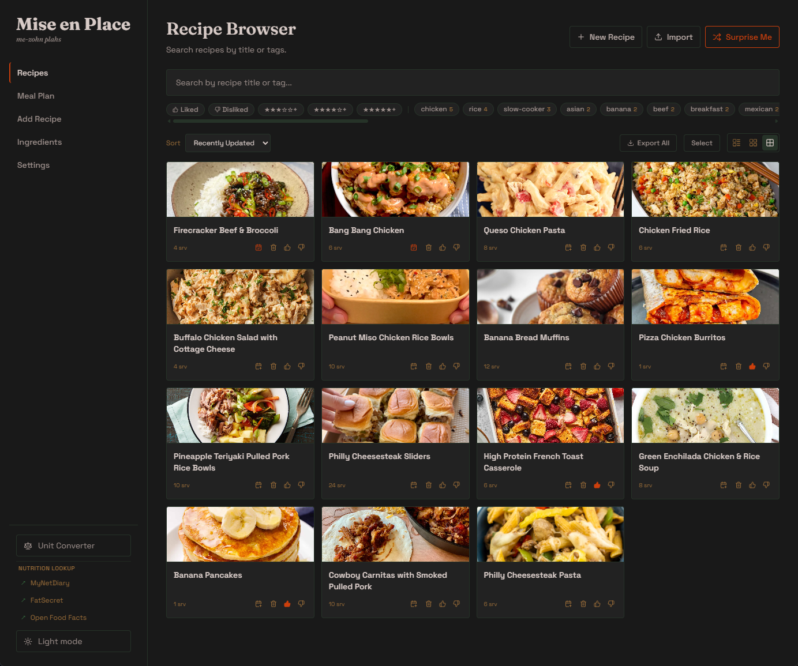
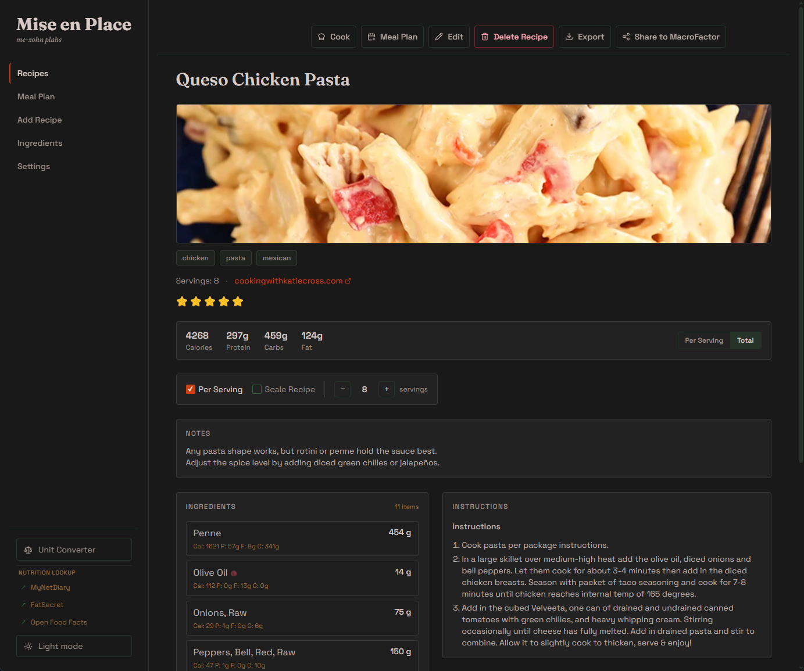
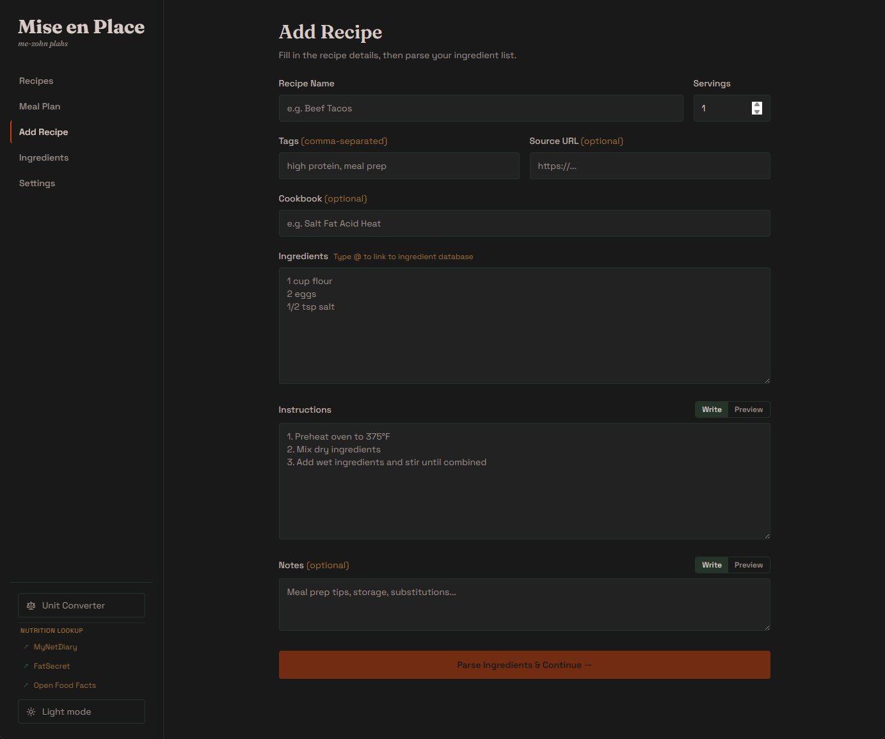
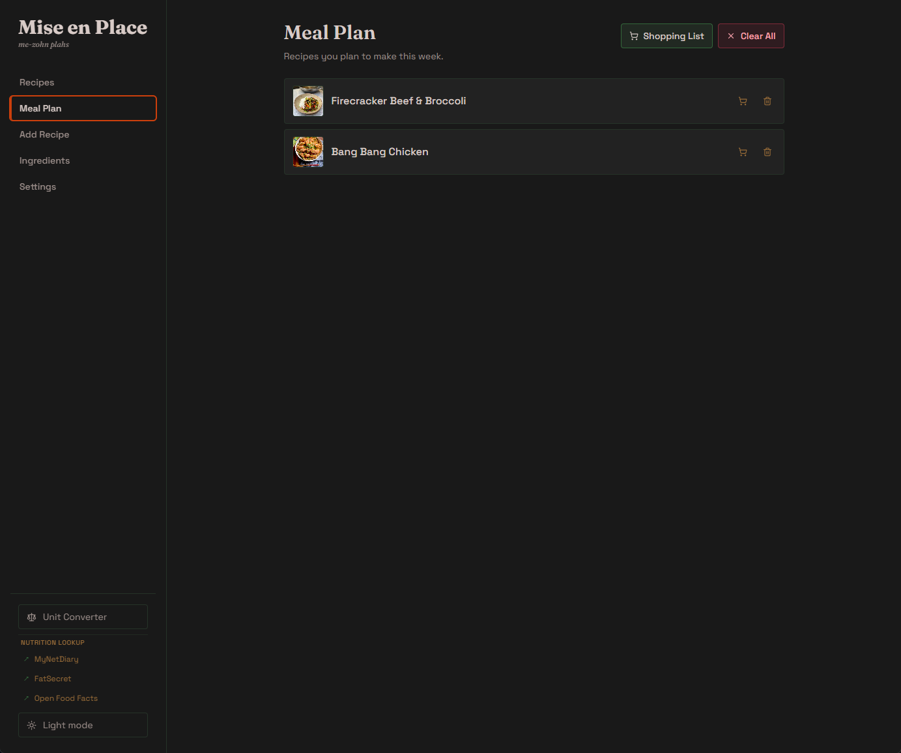
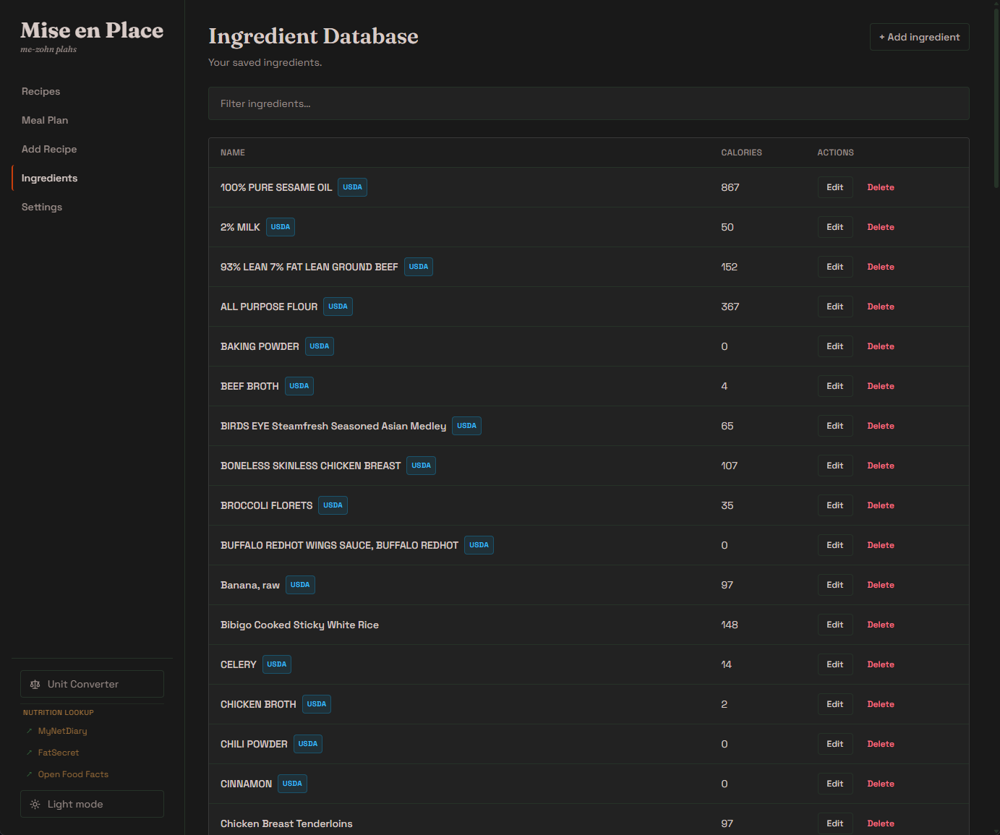

# Mise

Personal recipe manager with serving scaling, per-recipe macro calculation, and AI-assisted recipe creation and editing. Built with React, FastAPI, and SQLite.

<p align="center">
  
</p>

## Features

- **Recipe library** – create, edit, tag, rate, and organize recipes by cookbook, with image upload or URL. Ingredients can be split into labeled sections (marinade, sauce, …) that carry through the recipe view, cook mode, and Markdown export.
- **Serving scaling** – two modes, either saved back to the recipe. *Per Serving* re-portions a fixed dish: save a new serving count and the ingredient amounts stay put while the per-serving macros shift. *Scale Recipe* rewrites every ingredient amount for a new yield.
- **Macros** – ingredients link to a nutrition database (local, [USDA FoodData Central](https://fdc.nal.usda.gov/), or [Open Food Facts](https://world.openfoodfacts.org/), including barcode lookup); total and per-serving calories/protein/carbs/fat are calculated from the linked ingredients and displayed on the recipe, with a per-ingredient breakdown. No food diary or day-level tracking.
- **AI assistance** (any OpenAI-compatible API, [OpenRouter](https://openrouter.ai/) by default) – import a recipe from pasted text or a URL; turn a free-text ingredient list into structured rows (reading section headers and splitting shared-quantity lines like `10g salt, black pepper, chili powder` into separate items) and match each to the nutrition database; suggest tags; and a per-recipe **edit assistant** — describe an adjustment or correction in plain language and accept or decline each proposed change before it's saved.
- **Cook mode** – full-screen, checklist-style step view that keeps the screen awake.
- **Meal planning** – add recipes to a meal plan and generate a consolidated shopping list.
- **Sharing & export** – Markdown export/import, and a shareable recipe page that embeds schema.org Recipe metadata (with the calculated macros) so it can be pulled straight into [MacroFactor](https://macrofactorapp.com/)'s "import recipe from URL".

## Screenshots

<table>
  <tr>
    <td width="50%">
      <br>
      <sub><b>Recipe detail.</b> Calculated total and per-serving macros, the two-mode serving scaler, and a per-ingredient nutrition breakdown next to the instructions.</sub>
    </td>
    <td width="50%">
      <br>
      <sub><b>Add a recipe.</b> Paste a free-text ingredient list; the AI parses amounts, units, and section headers, then matches each item to the nutrition database.</sub>
    </td>
  </tr>
  <tr>
    <td width="50%">
      <br>
      <sub><b>Meal plan.</b> Collect recipes for the week and generate one consolidated, de-duplicated shopping list.</sub>
    </td>
    <td width="50%">
      <br>
      <sub><b>Ingredient database.</b> Every linked ingredient, sourced from USDA, Open Food Facts, or entered by hand.</sub>
    </td>
  </tr>
</table>

## Tech stack

| Layer    | Stack                                                            |
| -------- | --------------------------------------------------------------- |
| Frontend | React 19, React Router, Vite, Tailwind CSS                      |
| Backend  | FastAPI, SQLAlchemy, SQLite, httpx, RapidFuzz                   |
| AI       | Any OpenAI-compatible API (OpenRouter + `deepseek/deepseek-chat` by default) |
| Infra    | Docker Compose; images published to GHCR via GitHub Actions    |

## Project structure

```
backend/          FastAPI app
  app/
    routers/      recipes, ingredients, meal_plan, settings, share
    services/     AI, ingredient matching
    models/       SQLAlchemy models
    schemas/      Pydantic schemas
frontend/         React + Vite app
  src/pages/      RecipeBrowser, RecipeDetail, AddRecipe, IngredientDatabase, Settings
  src/components/ AiAssistPanel, AiChangeCard, shopping-list & unit-converter modals
docs/             planning notes
```

## Getting started

### Docker Compose (recommended)

```bash
cp .env.example .env   # then fill in the keys — see Configuration below
docker compose up
```

- Frontend: http://localhost:5173
- Backend API + docs: http://localhost:8001 / http://localhost:8001/docs

### Manual

Backend:

```bash
cp .env.example .env   # fill in the keys — see Configuration below
cd backend
python -m venv .venv && source .venv/bin/activate   # Windows: .venv\Scripts\activate
pip install -r requirements.txt
uvicorn app.main:app --reload --port 8001
```

Frontend:

```bash
cd frontend
npm install
npm run dev
```

## Configuration

### Backend

Copy `.env.example` to `.env` in the project root (git-ignored) and fill in:

| Variable | Required | Purpose |
| --- | --- | --- |
| `AI_API_KEY` | Yes, for AI features | API key for any OpenAI-compatible provider. `OPENROUTER_API_KEY` is still read as a fallback. |
| `AI_MODEL` | No | Model id. Default `deepseek/deepseek-chat`. |
| `AI_BASE_URL` | No | API base URL. Default `https://openrouter.ai/api/v1`. Point it at OpenAI, Groq, a local Ollama server, etc. |
| `USDA_API_KEY` | Recommended | [USDA FoodData Central](https://fdc.nal.usda.gov/api-key-signup.html) ingredient search. Without it, USDA lookups fall back to the shared `DEMO_KEY` (~30 requests/hour, 50/day per IP). |

Open Food Facts search and barcode lookup need no key.

The API key, model, and base URL can also be set from the app's **Settings** page, which writes them to `backend/app/.env`.

### Frontend

`VITE_API_URL` sets the API base URL. Vite loads `frontend/.env.development` for `npm run dev` and `frontend/.env.production` for `npm run build`; both are committed (no secrets). If unset, the code defaults to `http://localhost:8001/api`. See `frontend/.env.example`.

### Database

SQLite is created automatically at `backend/data/mise.db`; lightweight column migrations run on startup.

## Deployment

Pushing to `main` builds and publishes `mise-backend` and `mise-frontend` images to GHCR (the `:latest` tag). Deploy with a populated `.env` in the working directory:

```bash
docker compose -f docker-compose.prod.yml up -d
```

The production frontend is served by nginx on port 8080.

To update a running server once the "Build & Publish Docker Images" workflow has finished:

```bash
docker compose -f docker-compose.prod.yml pull
docker compose -f docker-compose.prod.yml up -d
```

No `git pull` is needed — the app code ships in the images. SQLite column migrations run automatically on backend startup, and the `mise_data` / `mise_uploads` volumes persist across updates.
