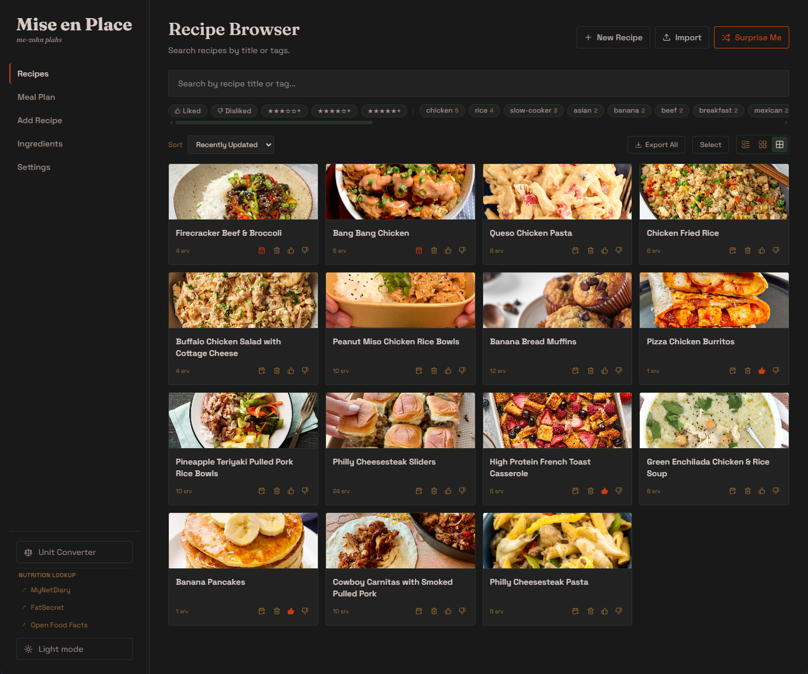
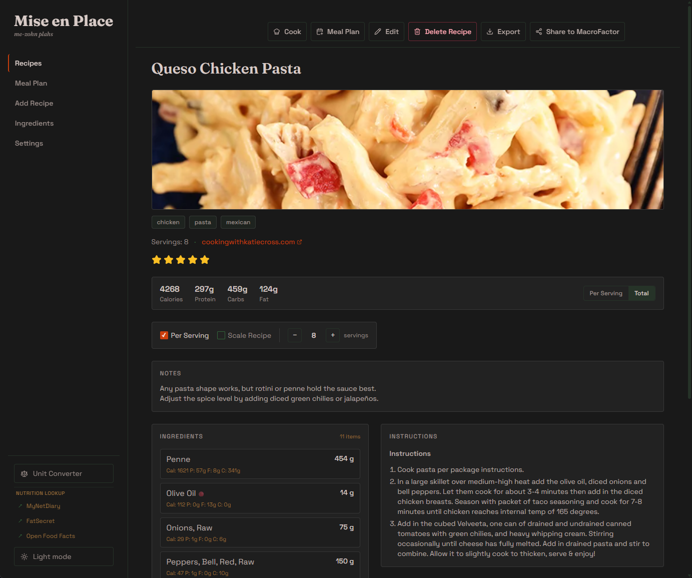
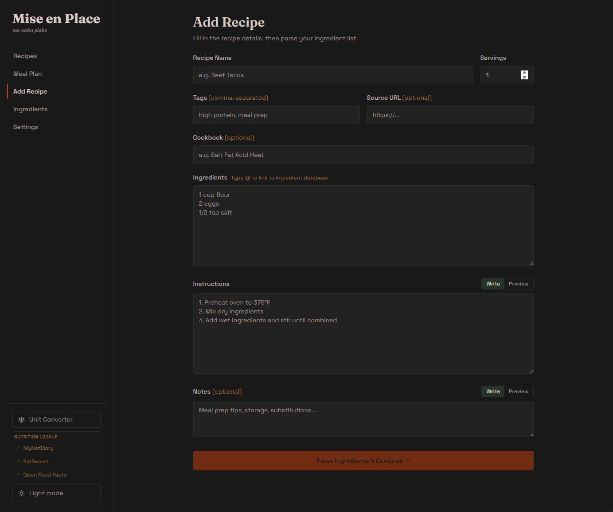
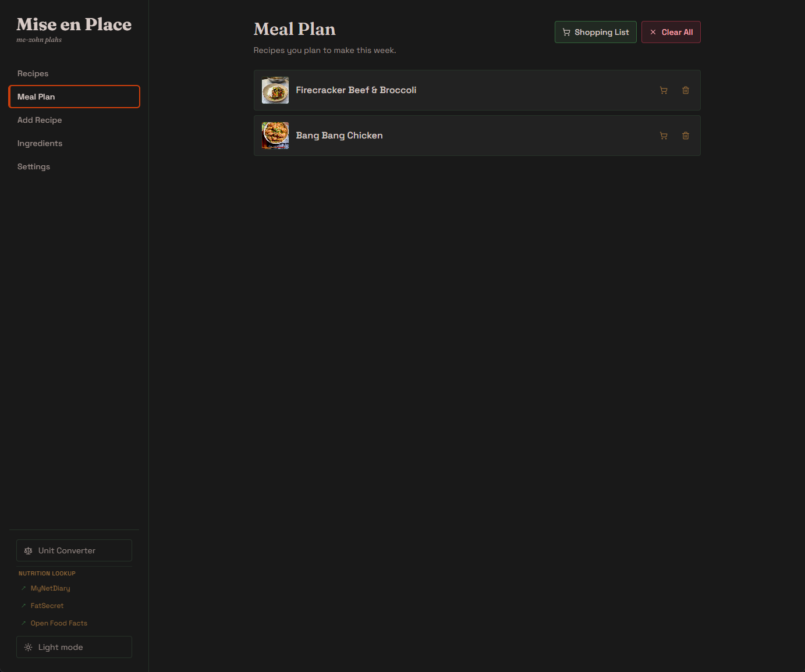
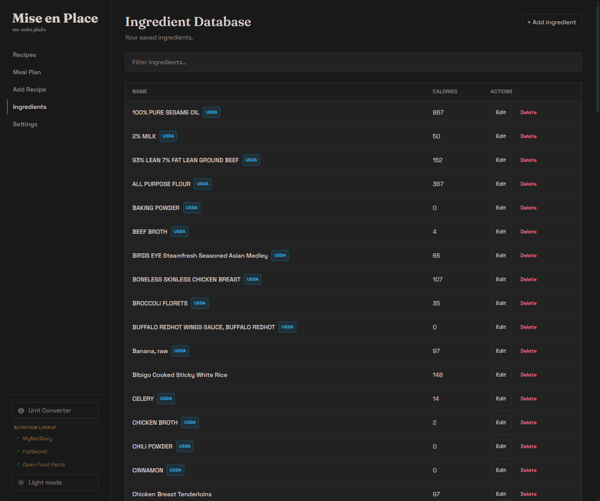
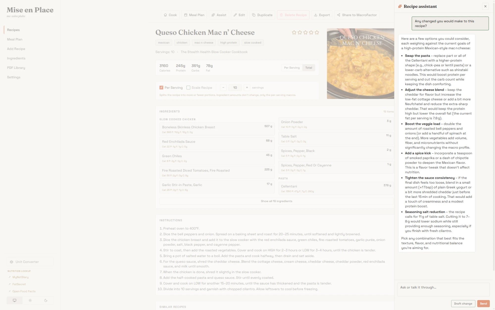
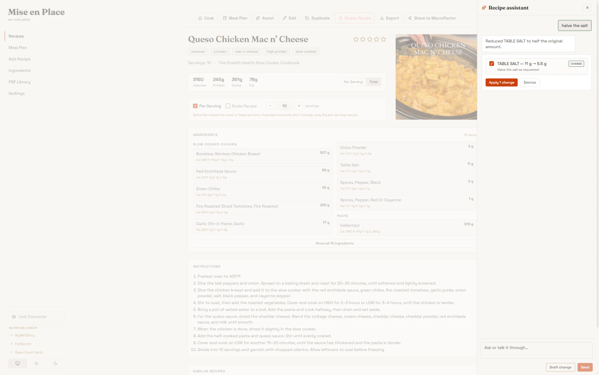
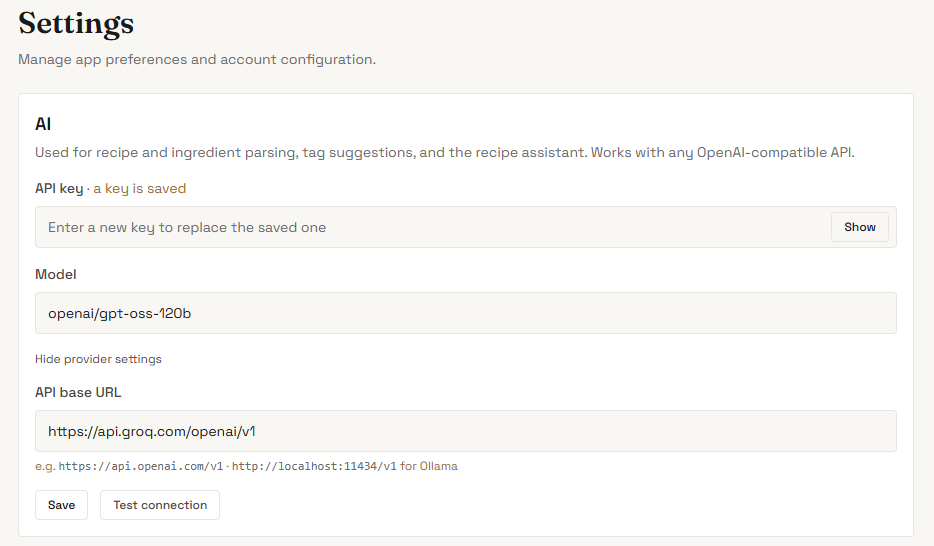
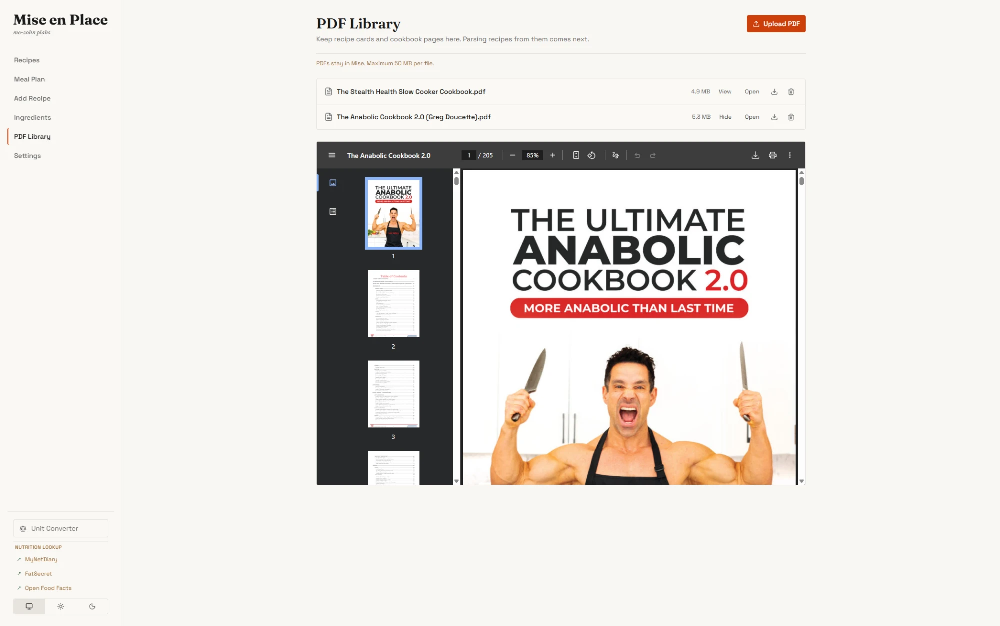

# Mise

Personal recipe manager with serving scaling, per-recipe macro calculation, and AI-assisted recipe creation and editing. Built with React, FastAPI, and SQLite.

<p align="center">
  
</p>

## Features

- **Recipe library** – create, edit, tag, rate, and organize recipes by cookbook, with image upload or URL. Ingredients can be split into labeled sections (marinade, sauce, …) that carry through the recipe view, cook mode, and Markdown export. Each recipe detail page also surfaces a **Similar Recipes** row, ranked by shared tags and shared linked ingredients.
- **Serving scaling** – two modes, either saved back to the recipe. *Per Serving* re-portions a fixed dish: save a new serving count and the ingredient amounts stay put while the per-serving macros shift. *Scale Recipe* multiplies every ingredient amount by a number you type (0.75, 1.25, …) with a live before/after calorie preview; Rescale saves the new amounts over the recipe and the servings count stays the same, so per-serving macros scale too. Weights and volumes keep two decimals and counts (eggs, cloves) round to whole numbers, never below 1.
- **Macros** – ingredients link to a nutrition database (local, [USDA FoodData Central](https://fdc.nal.usda.gov/), or [Open Food Facts](https://world.openfoodfacts.org/), including barcode lookup); total and per-serving calories/protein/carbs/fat are calculated from the linked ingredients and displayed on the recipe, with a per-ingredient breakdown. No food diary or day-level tracking.
- **AI assistance** (any OpenAI-compatible API, [OpenRouter](https://openrouter.ai/) by default — OpenAI, Groq, Together, local Ollama/LM Studio, etc. all work) – import a recipe from pasted text or a URL; turn a free-text ingredient list into structured rows (reading section headers and splitting shared-quantity lines like `10g salt, black pepper, chili powder` into separate items) and match each to the nutrition database; suggest tags; and a per-recipe **edit assistant** — chat with it freely about the recipe (nothing is ever proposed or changed from plain conversation), then press **Draft change** to turn a request into a diff you accept or decline, field by field, before anything is saved.
- **Cook mode** – Cook mode (full-screen, checklist-style step view) is built for a phone propped up next to the stove.
- **Meal planning** – add recipes to a meal plan and generate a consolidated shopping list.
- **PDF library** – upload cookbook PDFs (up to 50 MB) to a central library and view them in-browser; not tied to a specific recipe.
- **Sharing & export** – Markdown export/import, and a shareable recipe page that embeds schema.org Recipe metadata (with the calculated macros) so it can be pulled straight into [MacroFactor](https://macrofactorapp.com/)'s "import recipe from URL".

## Screenshots

<table>
  <tr>
    <td width="50%">
      <br>
      <sub><b>Recipe detail.</b> Calculated total and per-serving macros, the two-mode serving scaler, and a per-ingredient nutrition breakdown next to the instructions.</sub>
    </td>
    <td width="50%">
      <br>
      <sub><b>Add a recipe.</b> Paste a free-text ingredient list; the AI parses amounts, units, and section headers, then matches each item to the nutrition database.</sub>
    </td>
  </tr>
  <tr>
    <td width="50%">
      <br>
      <sub><b>Meal plan.</b> Collect recipes for the week and generate one consolidated, de-duplicated shopping list.</sub>
    </td>
    <td width="50%">
      <br>
      <sub><b>Ingredient database.</b> Every linked ingredient, sourced from USDA, Open Food Facts, or entered by hand.</sub>
    </td>
  </tr>
  <tr>
    <td width="50%">
      <br>
      <sub><b>Recipe assistant — chat.</b> Talk it through freely; nothing is ever proposed or changed from plain conversation.</sub>
    </td>
    <td width="50%">
      <br>
      <sub><b>Recipe assistant — Draft change.</b> Ask for an edit and press Draft change to get a diff you accept or decline, field by field, before anything is saved.</sub>
    </td>
  </tr>
  <tr>
    <td width="50%">
      <br>
      <sub><b>AI provider setup.</b> API key, model, and base URL in one place — point it at OpenRouter, OpenAI, Groq, Ollama, or any other OpenAI-compatible endpoint.</sub>
    </td>
    <td width="50%">
      <br>
      <sub><b>PDF library.</b> Upload cookbook PDFs and read them in-browser, no download required.</sub>
    </td>
  </tr>
</table>

## Tech stack

| Layer    | Stack                                                            |
| -------- | --------------------------------------------------------------- |
| Frontend | React 19, React Router, Vite, Tailwind CSS                      |
| Backend  | FastAPI, SQLAlchemy, SQLite, httpx, RapidFuzz                   |
| AI       | Any OpenAI-compatible API (OpenRouter + `deepseek/deepseek-chat` by default) |
| Infra    | Docker Compose; images published to GHCR via GitHub Actions    |

## Project structure

```
backend/          FastAPI app
  app/
    routers/      recipes, ingredients, meal_plan, pdfs, settings, share
    services/     AI, ingredient matching, nutrition
    models/       SQLAlchemy models
    schemas/      Pydantic schemas
frontend/         React + Vite app
  src/pages/      RecipeBrowser, RecipeDetail, AddRecipe, MealPlan, IngredientDatabase, PdfLibrary, Settings
  src/components/ AiAssistPanel, AiChangeCard, ImportRecipeModal, shopping-list & unit-converter modals
docs/             planning notes
```

## Getting started

### Docker Compose (recommended)

```bash
cp .env.example .env   # then fill in the keys — see Configuration below
docker compose up
```

- Frontend: http://localhost:5173
- Backend API + docs: http://localhost:8001 / http://localhost:8001/docs

### Manual

Backend:

```bash
cp .env.example .env   # fill in the keys — see Configuration below
cd backend
python -m venv .venv && source .venv/bin/activate   # Windows: .venv\Scripts\activate
pip install -r requirements.txt
uvicorn app.main:app --reload --port 8001
```

Frontend:

```bash
cd frontend
npm install
npm run dev
```

## Configuration

### Backend

Copy `.env.example` to `.env` in the project root (git-ignored) and fill in:

| Variable | Required | Purpose |
| --- | --- | --- |
| `AI_API_KEY` | Yes, for AI features | API key for any OpenAI-compatible provider. `OPENROUTER_API_KEY` is still read as a fallback. |
| `AI_MODEL` | No | Model id. Default `deepseek/deepseek-chat`. |
| `AI_BASE_URL` | No | API base URL. Default `https://openrouter.ai/api/v1`. Point it at OpenAI, Groq, a local Ollama server, etc. |
| `CORS_ORIGINS` | No | Comma-separated browser origins allowed to call the API. Default `http://localhost:5173,http://localhost:5174`. Set it when the dev frontend runs on another port or address (for example `npm run dev -- --port 5175`). Not needed in production, which is same-origin behind nginx. |
| `USDA_API_KEY` | Recommended | [USDA FoodData Central](https://fdc.nal.usda.gov/api-key-signup.html) ingredient search. Without it, USDA lookups fall back to the shared `DEMO_KEY` (~30 requests/hour, 50/day per IP). |

The `AI_*` variables are first-run defaults. Anything you save on the Settings page is stored in the data volume and overrides `.env` on every start, so a rebuild or redeploy never resets your model.

Open Food Facts search and barcode lookup need no key.

The API key, model, and base URL can also be set from the app's **Settings** page, which persists them to `/app/data/ai_settings.env` (the `mise_data` volume), so they survive container redeploys.

### Frontend

`VITE_API_URL` sets the API base URL. Vite loads `frontend/.env.development` for `npm run dev` and `frontend/.env.production` for `npm run build`; both are committed (no secrets). If unset, the code defaults to `http://localhost:8001/api`. See `frontend/.env.example`.

### Database

SQLite is created automatically at `backend/data/mise.db`; lightweight column migrations run on startup.

## Deployment

Pushing to `main` builds and publishes `mise-backend` and `mise-frontend` images to GHCR (the `:latest` tag). Deploy with a populated `.env` in the working directory:

```bash
docker compose up -d
```

The production frontend is served by nginx on port 8080.

To update a running server once the "Build & Publish Docker Images" workflow has finished:

```bash
docker compose pull
docker compose up -d
```

No `git pull` is needed — the app code ships in the images. SQLite column migrations run automatically on backend startup, and the `mise_data` / `mise_uploads` volumes persist across updates.

## Sharing recipes to MacroFactor

Every recipe has an unauthenticated `GET /share/recipe/{id}` page ([backend/app/routers/share.py](backend/app/routers/share.py)) that embeds schema.org `Recipe` JSON-LD — title, ingredients, instructions, and macros when available — for MacroFactor's **"import recipe from URL"** feature. Clicking **Share to MacroFactor** on a recipe copies that page's URL to your clipboard.

For an import to actually work, MacroFactor's own servers have to be able to fetch that URL directly, so:

1. **Mise needs a real, public HTTPS URL.** A `localhost` or LAN-only address is reachable in your browser but not from MacroFactor's side — deploy behind a real domain (see Deployment above).
2. **`/share/*` must be reachable without login.** Mise has no auth of its own, so if you've put anything in front of it — Cloudflare Access, Tailscale Funnel with auth, basic auth, a VPN-only ingress — that gate normally covers the whole app. MacroFactor's fetch isn't a browser session and can't complete a login, so if `/share/*` is behind it too, the import silently fails (it just fetches your login page instead of the recipe). Add an explicit bypass/exception for the `/share/` path specifically — e.g. in Cloudflare Access, a "bypass" policy scoped to `https://<your-domain>/share/*` — while keeping the rest of the app gated.
3. **Macros need linked ingredients.** The share page only includes a `nutrition` block if at least one ingredient on the recipe is linked to an entry in the nutrition database (matched during import/add, or linked manually from the Ingredients page). Unlinked ingredients are just skipped from the total, not treated as zero — a recipe with no linked ingredients gets no `nutrition` block at all.
4. **Uploaded photos are relative paths.** An image added via **Upload file** is stored and embedded as `/uploads/<file>` (relative to your domain), not an absolute URL. This renders fine in a normal browser view of the share page, but if MacroFactor's importer doesn't resolve relative image URLs against the page it fetched them from, the photo may not come through — pasting an external image URL via **Use URL** instead avoids the question entirely, since that's stored as a full URL already.

Once those are in place: open the recipe → **Share to MacroFactor** → paste the copied link into MacroFactor's import-from-URL flow.
